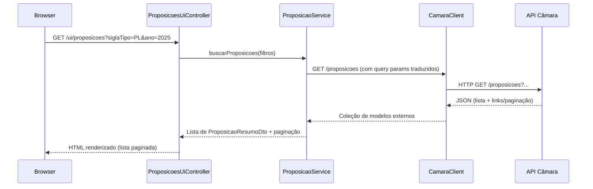

# 🗳️ Voto Aberto — MVP

**Portal unificado de dados políticos do Brasil** usando a **API de Dados Abertos da Câmara dos Deputados**.  
Escopo deste MVP: **somente backend** em **Java 17 + Spring Boot 3**, com **Thymeleaf** para **renderização server‑side** (páginas HTML simples para apresentação dos dados).

> **Telas focadas neste MVP:**
> - **Partidos:** ao selecionar um partido, exibir **todos os seus membros**.
> - **Perfil do Deputado:** **despesas mensais** + **proposições autoradas** (ativas/aprovadas/rejeitadas) e **status**.
> - **Proposições & Busca (PL):** **busca geral por proposições**, com filtros (siglaTipo=PL, ano, número, autor, status) e **detalhe** com **tramitacoes** e **autores**.

---

## 📌 Sumário Técnico
- [Visão Geral e Objetivos](#visão-geral-e-objetivos)
- [Arquitetura (MVC) e Pastas](#arquitetura-mvc-e-pastas)
- [Camada Web (UI/Thymeleaf)](#camada-web-uithymeleaf)
- [Camada REST (API interna do projeto)](#camada-rest-api-interna-do-projeto)
- [Camada de Serviço (Regras/Aggregations)](#camada-de-serviço-regrasaggregations)
- [Camada de Integração (Cliente Câmara)](#camada-de-integração-cliente-câmara)
- [Modelo de Dados & DTOs](#modelo-de-dados--dtos)
- [Classificação de Status de Proposições](#classificação-de-status-de-proposições)
- [Paginação, Ordenação e Filtros](#paginação-ordenação-e-filtros)
- [Erros, Observabilidade e Resiliência](#erros-observabilidade-e-resiliência)
- [Configuração, Build e Execução](#configuração-build-e-execução)
- [Testes (unitários e de integração)](#testes-unitários-e-de-integração)
- [Roadmap do MVP → Próximos passos](#roadmap-do-mvp--próximos-passos)
- [Licença](#licença)

---

## Visão Geral e Objetivos

Consolidar, em **endpoints internos e páginas Thymeleaf**, dados da **Câmara dos Deputados**:

- **Partidos:** listagem, detalhe e **membros**.
- **Deputados:** perfil com **despesas mensais** e **proposições autoradas** classificadas por status.
- **Proposições (inclui PL):** **busca geral** com filtros + **detalhe** (autores + tramitacoes + status).

**Princípios do MVP:**
- **Sem banco** (no MVP): dados **direto da API externa**; cache **in‑memory** opcional.
- **UI mínima** via Thymeleaf (SSR).
- **Controllers separados** para **API** (`/api/v1/...`) e **UI** (`/ui/...`).

---

## Arquitetura (MVC) e Pastas

```
src/
└── main/
    ├── java/
    │   └── br/com/vinicius/votoaberto/
    │       ├── VotoAbertoApplication.java
    │       │
    │       ├── config/
    │       │   ├── HttpConfig.java
    │       │   └── WebConfig.java
    │       │
    │       ├── web/
    │       │   ├── controller/
    │       │   │   ├── PartidosUiController.java     # /ui/partidos, /ui/partidos/{id}
    │       │   │   ├── DeputadosUiController.java    # /ui/deputados/{id}
    │       │   │   └── ProposicoesUiController.java  # /ui/proposicoes, /ui/proposicoes/{id}
    │       │   └── advice/GlobalExceptionHandler.java
    │       │
    │       ├── api/
    │       │   ├── PartidosController.java           # /api/v1/partidos...
    │       │   ├── DeputadosController.java          # /api/v1/deputados...
    │       │   └── ProposicoesController.java        # /api/v1/proposicoes...
    │       │
    │       ├── service/
    │       │   ├── PartidoService.java
    │       │   ├── DeputadoService.java
    │       │   └── ProposicaoService.java
    │       │
    │       ├── client/camara/
    │       │   ├── CamaraClient.java
    │       │   └── CamaraEndpoints.java
    │       │
    │       ├── dto/
    │       │   ├── partido/PartidoDto.java
    │       │   ├── partido/PartidoDetalheDto.java
    │       │   ├── deputado/DeputadoDto.java
    │       │   ├── deputado/DeputadoDetalheDto.java
    │       │   ├── deputado/DespesaMensalDto.java
    │       │   ├── proposicao/ProposicaoResumoDto.java
    │       │   ├── proposicao/ProposicaoDetalheDto.java
    │       │   ├── proposicao/ProposicaoStatusCountDto.java
    │       │   └── proposicao/AutorResumoDto.java
    │       │
    │       ├── mapper/
    │       │   ├── PartidoMapper.java
    │       │   ├── DeputadoMapper.java
    │       │   └── ProposicaoMapper.java
    │       │
    │       ├── exception/
    │       │   ├── ApiException.java
    │       │   ├── ExternalApiException.java
    │       │   └── ErrorResponse.java
    │       │
    │       └── util/
    │           ├── DateUtils.java
    │           └── PaginationUtils.java
    │
    └── resources/
        ├── application.yml
        ├── templates/
        │   ├── layout.html
        │   ├── partidos/{index,detalhe}.html
        │   ├── deputados/detalhe.html
        │   └── proposicoes/{index,detalhe}.html
        ├── static/
        └── messages.properties
```

### Diagrama de Componentes (Mermaid)
```mermaid
flowchart LR
  UI[Thymeleaf Views] --> C1[UI Controllers (/ui)]
  C1 --> S[Services]
  API[REST Controllers (/api/v1)] --> S
  S --> CL[CamaraClient]
  CL -->|HTTP| CAMARA[(API Câmara dos Deputados)]
```

---

## Camada Web (UI/Thymeleaf)

### Rotas (SSR)
- `GET /ui/partidos` → lista partidos (sigla, nome, id, situação).
- `GET /ui/partidos/{id}` → detalhe + **membros** paginados.
- `GET /ui/deputados/{id}` → perfil: dados básicos + **despesas mensais agregadas** + **proposições autoradas** (listas por status + cards de recentes).
- `GET /ui/proposicoes` → **busca geral** com formulário (filtros) + resultado paginado.
- `GET /ui/proposicoes/{id}` → **detalhe**: ementa, autores, **última tramitação**, link para tramitações e votações relacionadas (quando disponível).

### UI: `proposicoes/index.html` (exemplo de filtros)
- **Campos:** `siglaTipo` (default **PL**), `ano`, `numero`, `autorId`, `statusClassificado` (ATIVAS/APROVADAS/REJEITADAS), `q` (texto livre).  
- **Resultados:** tabela com `siglaTipo/numero/ano`, `ementa` (compacta), `autorPrincipal`, `situacaoAtual`, `statusClassificado`.  
- **Ações:** link para detalhe (`/ui/proposicoes/{id}`) e para perfil do autor (`/ui/deputados/{autorId}`) quando aplicável.

---

## Camada REST (API interna do projeto)

### Proposições (inclui PL)
- `GET /api/v1/proposicoes?siglaTipo=PL&ano=&numero=&autorId=&status=&q=&pagina=&itens=&ordenarPor=&ordem=`  
  - **Retorna**: lista paginada de `ProposicaoResumoDto`.
- `GET /api/v1/proposicoes/{id}` → `ProposicaoDetalheDto`
- `GET /api/v1/proposicoes/{id}/autores` → `List<AutorResumoDto>`
- `GET /api/v1/proposicoes/{id}/tramitacoes?ordem=desc&itens=100`
- `GET /api/v1/proposicoes/{id}/votacoes` *(se aplicável na origem)*

### Partidos
- `GET /api/v1/partidos?pagina=&itens=&ordenarPor=`
- `GET /api/v1/partidos/{id}`
- `GET /api/v1/partidos/{id}/membros?pagina=&itens=`

### Deputados
- `GET /api/v1/deputados/{id}`
- `GET /api/v1/deputados/{id}/despesas?ano=YYYY&mes=MM`
- `GET /api/v1/deputados/{id}/despesas/aggregated?anoInicio=&anoFim=&mensal=true`
- `GET /api/v1/deputados/{id}/proposicoes?status=ATIVAS|APROVADAS|REJEITADAS`
- `GET /api/v1/deputados/{id}/resumo`

---

## Camada de Serviço (Regras/Aggregations)

### ProposicaoService
- `buscarProposicoes(Filtros filtros, Paginacao pag)`  
  Traduz **filtros** para a API da Câmara quando suportados; caso contrário, aplica **pós‑filtro** localmente.
- `detalharProposicao(Long id)` + `listarAutores(Long id)`  
- `listarTramitacoes(Long id, ...)` + `ultimaTramitacao(Long id)`  
- `classificarStatus(Proposicao origem)` → `ATIVA/APROVADA/REJEITADA/OUTROS`  
- `resumir(Proposicao origem)` → `ProposicaoResumoDto`

### PartidoService / DeputadoService
- Iguais à versão anterior, com composição de chamadas no `CamaraClient`.

---

## Camada de Integração (Cliente Câmara)

`CamaraClient` concentra chamadas HTTP (via `RestClient`), centralizando:
- **Builders de URL** para `/proposicoes`, `/proposicoes/{id}`, `/proposicoes/{id}/autores`, `/proposicoes/{id}/tramitacoes`, …
- **Tratamento de paginação** e **metadados** da resposta da Câmara.
- **Conversão** para DTOs internos (mapper) antes de chegar na `service`.

### Fluxo de Busca (Proposições)


---

## Modelo de Dados & DTOs

```java
// Proposição (listagem e detalhe)
record ProposicaoResumoDto(
  Long id, String siglaTipo, Integer numero, Integer ano,
  String ementa, String autorPrincipal,
  String situacaoAtual, ProposicaoStatus statusClassificado
) {}

record ProposicaoDetalheDto(
  Long id, String siglaTipo, Integer numero, Integer ano,
  String ementa, String tema, String uriInteiroTeor,
  String situacaoAtual, ProposicaoStatus statusClassificado,
  List<AutorResumoDto> autores,
  String ultimaTramitacaoDescricao, Instant ultimaTramitacaoData
) {}

record AutorResumoDto(Long id, String nome, String tipoAutor, String partidoUf) {}
```

> **Campos como `tema`, `uriInteiroTeor`, `votacoes`** são preenchidos **condicionalmente** conforme disponibilidade na origem. Quando não disponível, o DTO **omite** o campo (Jackson `non_null`).

---

## Classificação de Status de Proposições

Mesma abordagem da versão anterior, aplicando **mapeamento determinístico** com fallback para `OUTROS`. Tabela resumida:

| Termo/situação na origem (contém) | Bucket |
|---|---|
| `Em tramitação`, `Aguardando`, `Distribuído`, `Relatoria` | **ATIVAS** |
| `Aprovado`, `Sancionado`, `Promulgado`, `Transformado` | **APROVADAS** |
| `Rejeitado`, `Arquivado`, `Prejudicado`, `Devolvido`, `Retirado` | **REJEITADAS** |
| Não mapeado | **OUTROS** |

---

## Paginação, Ordenação e Filtros

- **`/api/v1/proposicoes`** aceita:  
  `siglaTipo` (default **PL**), `ano`, `numero`, `autorId`, `status` (mapeado), `q` (texto livre), `pagina`, `itens`, `ordenarPor`, `ordem`.
- Nos casos não suportados pela origem, aplica‑se **pós‑filtro** e **pós‑ordenação** locais.
- **UI** apresenta **página anterior/próxima** e **contador** total (quando disponível).

---

## Erros, Observabilidade e Resiliência

- **Timeout** (ex.: 10s) + **retry leve** (1) no `CamaraClient`.
- **Logs** de latência e código HTTP das chamadas externas.
- **Handler global** renderiza JSON na API e página amigável na UI.

---

## Configuração, Build e Execução

### `application.yml`
```yaml
server:
  port: 8080

votoaberto:
  camara:
    base-url: https://dadosabertos.camara.leg.br/api/v2
    timeout-ms: 10000

spring:
  thymeleaf:
    cache: false
  jackson:
    default-property-inclusion: non_null
logging:
  level:
    br.com.vinicius.votoaberto: INFO
```

### Rodando
```bash
./mvnw spring-boot:run
# http://localhost:8080/ui/partidos
# http://localhost:8080/ui/proposicoes
# http://localhost:8080/ui/proposicoes/{id}
# http://localhost:8080/ui/deputados/{id}
```

---

## Testes (unitários e de integração)

- **ProposicaoServiceTest** cobre:  
  - Tradução correta de filtros para a origem;  
  - Pós‑filtro local para campos não suportados;  
  - Classificação de status determinística;  
  - Montagem de `ProposicaoDetalheDto` com `autores` + `ultimaTramitacao`.
- **Controller tests** para `/api/v1/proposicoes` e `/ui/proposicoes` checando paginação e conteúdo renderizado.

---

## Roadmap do MVP → Próximos passos

- **Cache** de buscas mais comuns (Caffeine).
- **Export CSV/JSON** para resultados de proposições e despesas do deputado.
- **Links cruzados**: proposição ↔ votações ↔ deputados autores/relatores.
- **Swagger/OpenAPI** para `/api/v1`.
- **CI/CD** com GitHub Actions.

---

## Licença

**MIT** — Dados: **Câmara dos Deputados (Dados Abertos)**.  
Este projeto **não coleta** dados pessoais e atua somente como **agregador/visualizador**.
