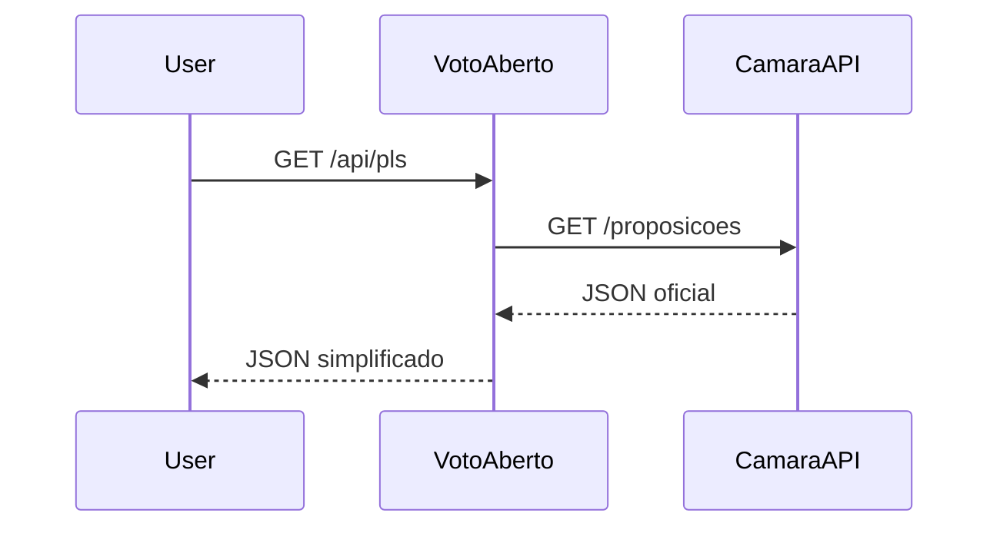

# 🗳️ Voto Aberto

> **Quem propõe. Quem vota. Quem decide.**  
> Um portal aberto de transparência legislativa para qualquer cidadão,  
> feito em **Java + Spring Boot** e testado via **Postman**.

---

## 📌 O que é o Voto Aberto?

O **Voto Aberto** é uma aplicação que consome dados oficiais da [API de Dados Abertos da Câmara dos Deputados](https://dadosabertos.camara.leg.br/) e organiza em **endpoints claros e simplificados**, permitindo que **qualquer pessoa, mesmo leiga em política**, consiga:

- 📜 Entender rapidamente **quais projetos de lei estão em pauta**.  
- 🧑‍🤝‍🧑 Saber **quem propôs** cada projeto.  
- 📊 Acompanhar **como partidos e deputados votaram**.  
- 🚦 Visualizar o **status e próximos passos** de cada proposta.  
- 🔍 Comparar atuações de partidos e parlamentares em diferentes temas.  

Nosso objetivo é **quebrar a barreira do juridiquês** e oferecer **transparência prática** em tempo real.

---

## 💡 Por que esse projeto existe?

Acompanhar a política no Brasil é difícil para quem não é especialista:  
- Documentos são longos e técnicos.  
- Termos jurídicos confundem.  
- O andamento dos projetos é pouco acessível.  
- É difícil saber **quem votou em quê**.  

O **Voto Aberto** existe para mudar isso: traduzindo dados legislativos para **informações úteis e compreensíveis** que impactam diretamente a vida das pessoas.

---

## 🛠️ Tecnologias utilizadas

- **Java 17**  
- **Spring Boot 3.3.x**  
  - Spring Web (REST Controllers)  
  - RestClient (para consumir a API da Câmara)  
- **Maven** (build e dependências)  
- **Postman** (testes e documentação das rotas)  
- **JSON** (respostas da API)  
- **Docker** *(planejado, para deploy futuro)*  

---

## 🌐 Fonte de dados

Toda informação é obtida em tempo real da **API de Dados Abertos da Câmara dos Deputados**:

- Base URL: `https://dadosabertos.camara.leg.br/api/v2/`  
- Acesso público, sem autenticação.  
- Requer apenas `User-Agent` e `Accept: application/json` como boas práticas.  

---

## 📂 Estrutura de pastas

```bash
src/main/java/br/com/vinicius/votoaberto/
  VotoAbertoApplication.java     # Main
  api/ProposicoesController.java # Endpoints REST
  core/ProposicoesService.java   # Lógica e chamadas externas
  config/HttpConfig.java         # RestClient
src/main/resources/
  application.yml
  banner.txt
```

---

## 🏗️ Arquitetura

Fluxo simplificado do sistema:



---

## 🚀 Como rodar

### Pré-requisitos

- Java 17+  
- Maven 3.9+  
- Postman (para testar)  

### Passos

```bash
# Clonar o repositório
git clone https://github.com/seu-usuario/voto-aberto.git
cd voto-aberto

# Rodar com Maven
./mvnw spring-boot:run
```

Aplicação sobe em:  
👉 `http://localhost:8080`

---

## 🔗 Endpoints disponíveis

Todos os endpoints do **Voto Aberto** seguem o prefixo `/api`.  
Eles servem de proxy simplificado para a API da Câmara.

---

### 📜 Proposições (Projetos de Lei e outros)

- **Listar PLs**  
  `GET /api/pls?ano=2025&itens=5`  
  **Exemplo de resposta**:
  ```json
  [
    {
      "id": 12345,
      "siglaTipo": "PL",
      "numero": 678,
      "ano": 2025,
      "ementa": "Dispõe sobre a transparência digital em serviços públicos.",
      "status": "Em tramitação",
      "autor": "Deputado João Silva",
      "ultimoEvento": "Aguardando parecer da CCJ"
    }
  ]
  ```

- **Detalhe do PL**  
  `GET /api/pls/{id}`  

- **Autores do PL**  
  `GET /api/pls/{id}/autores`  

- **Última tramitação do PL**  
  `GET /api/pls/{id}/tramitacoes/ultima`  

- **Todas as tramitações**  
  `GET /api/pls/{id}/tramitacoes`  

---

### 🗳️ Votações

- **Listar votações por período**  
  `GET /api/votacoes?dataInicio=2025-08-01&dataFim=2025-08-31&itens=5`  

- **Detalhe de uma votação**  
  `GET /api/votacoes/{id}`  

- **Votos nominais de uma votação**  
  `GET /api/votacoes/{id}/votos`  

- **Orientação de bancada** *(via datasets)*  
  `GET /api/votacoes/{id}/orientacoes`  

---

### 👥 Partidos

- **Listar partidos**  
  `GET /api/partidos`  

- **Detalhar partido**  
  `GET /api/partidos/{id}`  

- **Deputados de um partido**  
  `GET /api/partidos/{id}/membros`  

---

### 👤 Deputados

- **Listar deputados**  
  `GET /api/deputados?siglaUf=SP&siglaPartido=PT`  

- **Detalhar deputado**  
  `GET /api/deputados/{id}`  

- **Discursos de deputado**  
  `GET /api/deputados/{id}/discursos`  

- **Eventos de participação**  
  `GET /api/deputados/{id}/eventos`  

---

### 📊 Extras (úteis para analíticos)

- **Eventos do plenário**  
  `GET /api/eventos`  

- **Órgãos (comissões)**  
  `GET /api/orgaos`  

- **Despesas de deputados**  
  `GET /api/deputados/{id}/despesas`  

---

## 📖 Glossário (para leigos)

- **Proposição** → Projeto de lei, medida provisória ou requerimento.  
- **Tramitação** → Caminho que o projeto percorre até virar lei.  
- **Relatoria** → Quem é o responsável pelo parecer de um projeto.  
- **Votação simbólica** → Quando não há voto nominal, apenas aprovação geral.  

---

## 📅 Roadmap

### Funcional
- ✅ MVP com PLs, tramitações e votações.  
- ⏳ Dashboard com filtros temáticos (saúde, educação, impostos).  
- ⏳ Alertas por tema/autor (via e-mail/Telegram).  
- ⏳ Comparador entre partidos.  
- ⏳ Exportação CSV/JSON via frontend.  
- ⏳ Deploy com Docker + Heroku/Render.  

### Técnico
- 🚀 Implementar cache com Redis.  
- 🚀 Documentar API com Swagger/OpenAPI.  
- 🚀 Testes unitários com JUnit/Mockito.  
- 🚀 Adicionar CI/CD com GitHub Actions.  
- 🚀 Deploy em Kubernetes (futuro).  

---

## 🔒 Segurança e Limitações

- O sistema **não coleta dados pessoais** dos usuários.  
- Toda a informação vem da **API oficial da Câmara**.  
- Pode haver **indisponibilidade ou atraso** na atualização dos dados.  
- Recomendado uso de **cache local** para evitar sobrecarga.  

---

## 📊 Métricas de sucesso

- % de usuários que leem o resumo até o fim.  
- Cliques no botão "Por que importa?".  
- Taxa de retorno de usuários que ativam alertas.  
- Compartilhamentos de cards em redes sociais.  

---

## 👨‍💻 Contribuindo

1. Faça um fork.  
2. Crie uma branch (`git checkout -b feature/nome`).  
3. Commit suas alterações (`git commit -m 'feat: ...'`).  
4. Abra um Pull Request.  

---

## 📜 Licença

MIT — livre para uso e modificação.  
Dados de fonte oficial: [Câmara dos Deputados](https://dadosabertos.camara.leg.br/).  
